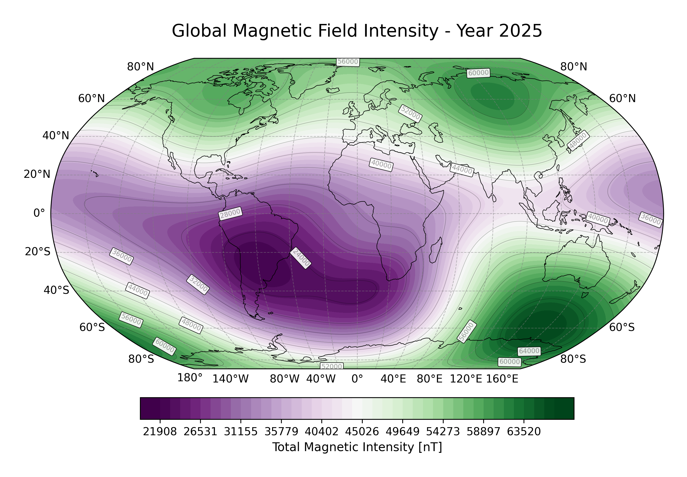
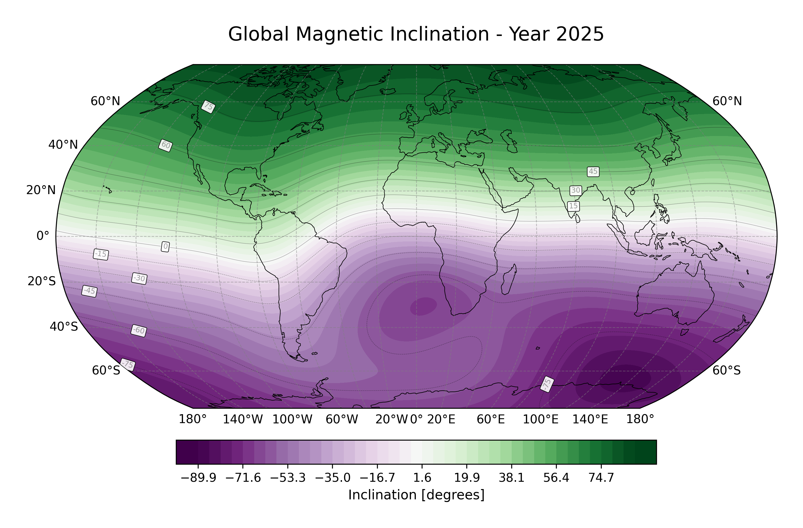

# Geomagnetic Reference Field { #mag data-toc-label="Geomagnetic Reference Field" }

The **International Geomagnetic Reference Field (IGRF)** is a standard mathematical description of the Earth's main magnetic
field, produced and endorsed by the [International Association of Geomagnetism and Aeronomy (IAGA)](https://iugg.org/associations-commissions/associations/iaga/).
It is widely used in studies of the Earth's deep interior, crust, ionosphere, and magnetosphere.

!!! tip "Magnetic field in SAR context"

    While the geomagnetic field does not directly affect SAR signal propagation, an accurate magnetic field model is essential
    for example for **space weather** corrections in ionospheric modelling.

<figure markdown="span">
  <video width="900" controls autoplay loop muted>
    <source src="../../../assets/images/p/intensity_variation.mp4" type="video/mp4">
    Your browser does not support the video tag.
  </video>
  <figcaption>
    Earth's magnetic field intensity variation from 1900 (IGRF-14).
  </figcaption>
</figure>

---

## The IGRF Model

The IGRF represents the Earth's magnetic field as the negative gradient of a scalar potential $V$ expanded in spherical harmonics up to degree 13:

$$
V(r,\theta,\phi,t) = a \sum_{n=1}^{13} \left(\frac{a}{r}\right)^{n+1} \sum_{m=0}^{n}
\left[ g_n^m(t) \cos(m\phi) + h_n^m(t) \sin(m\phi) \right] P_n^m(\cos\theta)
$$

where:

- $a = 6371.2$ km is the geomagnetic reference Earth radius
- $r$ is the radial distance from the Earth's centre \[km\]
- $\theta$ is the geocentric colatitude \[degrees\]
- $\phi$ is the longitude \[degrees\]
- $P_n^m$ are the Schmidt semi-normalized associated Legendre functions
- $g_n^m, h_n^m$ are the Gauss coefficients of degree $n$ and order $m$, linearly interpolated in time

The magnetic field is then obtained as:

$$
\mathbf{B} = -\nabla V
$$

The model is updated every five years. The implemented **IGRF-14** iteration was released in October 2024 and covers
the period **1900–2030**. Secular variation coefficients are pre-computed into the shipped `.shc` coefficient file.

<figure markdown="span">
    { width="900" }
    <figcaption>Earth's magnetic field intensity in 2025 obtained with this tool.</figcaption>
</figure>

---

## Scalar Magnetic Potential

The function `get_geocentric_igrf_potential` directly evaluates the scalar magnetic potential $V$ at given geocentric
coordinates. This is useful when the potential itself (rather than the field) is required.

---

## Coordinate Systems

Two coordinate frames are supported for field evaluation:

### Geocentric (Spherical)

Used by `get_geocentric_igrf`. Input coordinates: `[radius (km), colatitude (deg), longitude (deg)]`.

Output magnetic field components:

| Component | Direction |
|-----------|-----------|
| $B_r$     | Radial (positive outward) |
| $B_\theta$ | Southward (tangential, decreasing colatitude) |
| $B_\phi$  | Eastward (tangential) |

### Geodetic (WGS84)

Used by `get_geodetic_igrf`. Input coordinates: `[longitude (deg), latitude (deg), height (km above WGS84 ellipsoid)]`.

The geocentric-to-geodetic conversion accounts for the ellipsoidal shape of the Earth (WGS84) and rotates the magnetic
field vector accordingly.

Output magnetic field components:

| Component | Direction |
|-----------|-----------|
| $B_e$     | Eastward |
| $B_n$     | Northward (tangential to the ellipsoid) |
| $B_u$     | Upward (perpendicular to the ellipsoid) |

---

## Derived Magnetic Field Angles

Two angular quantities can be derived from the geodetic field components:

- **Inclination ($I$)**: angle between the field vector and the horizontal plane, -Bu to match the standard definition of $I>0$ -> downward.

    $$
    I = \arctan \left(\frac{-B_u}{\sqrt{B_e^2 + B_n^2}}\right)
    $$

- **Declination ($D$)**: angle between true north and magnetic north at a particular location. If $D>0$, the magnetic declination is East, otherwise West..

    $$
    D = \arctan2 \left(B_e, B_n\right)
    $$

<figure markdown="span">
    { width="900" }
    <figcaption>Earth's magnetic field inclination in 2025 obtained with this tool.</figcaption>
</figure>

---

## References

- International Association of Geomagnetism and Aeronomy (2024) "IGRF-14". Zenodo.
  [https://doi.org/10.5281/zenodo.14218973](https://doi.org/10.5281/zenodo.14218973)
- The implementation is based on the ``IAGA-VMOD/ppigrf`` project by Karl M. Laundal, Santiago Soler, Ashley Smith,
  Andreas S. Skeidsvoll and Daniel Billett.
  [https://doi.org/10.5281/zenodo.14231854](https://doi.org/10.5281/zenodo.14231854)
- Schmidt semi-normalized Legendre functions algorithm from Wertz, James R. (1978) "Spacecraft attitude determination
  and control". [https://doi.org/10.1007/978-94-009-9907-7](https://doi.org/10.1007/978-94-009-9907-7)
