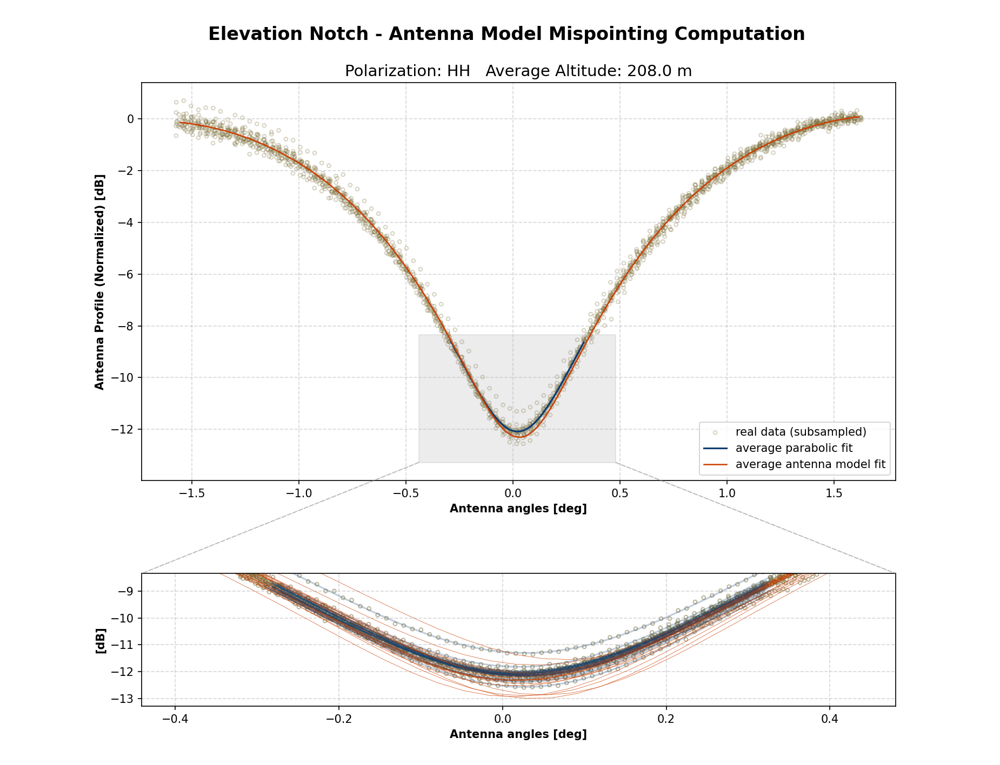

# Algorithm description

The procedure for the estimation of the elevation pointing offset is based on the Least Square fitting of the elevation
profile of the focused data with a three parameters model:

$$
d(\theta_{off};k,\theta_{mis},n) = k \cdot p(\theta_{off} - \theta_{mis}) + n \cdot f(\theta_{off})
$$

where $p(\theta_{off})$ is the Elevation Notch antenna pattern as a function of the off-boresight angle and
$f(\theta_{off})$ is the noise floor after compensation of the spread losses and the conversion of the data from
Beta Nought to Gamma Nought.

The model parameters are estimated by minimizing the sum of the squared differences between the measured and theoretical
profiles as shown in the following equation:

$$
argmin_{k,\theta_{mis},n}||\hat{d}(\theta_{i})-d(\theta_{i})||^{2}
$$

where $\hat{d}(\theta_{i})$ is the vector containing the values of the range profile measured on the SAR data at
certain off-boresight angles, and $d(\theta_{i})$ is the model in evaluated at the same angles.

The three parameters to be estimated are:

- $k$ the calibration factor for the antenna pattern
- $\theta_{mis}$ the elevation mis-pointing angle
- $n$ the calibration factor for the thermal noise

The resulting $\theta_{mis}$ angle is the estimated pointing bias.

The previously described estimation procedure is carried out **only when the Antenna Pattern is provided**. This input
must be provided as a nested dictionary of [XArray Datasets](https://docs.xarray.dev/en/stable/generated/xarray.Dataset.html)
containing the gain of and the elevation angles axis as shown below.

```python title="Example of antenna pattern dataset"
import xarray as xr

antenna_pattern_datasets = {
    "swath": {
        "polarization": xr.Dataset(
        {
            "gain": (
                ["azimuth_angles", "elevation_angles"],
                gain_data,  # in dB
            ),
            ...
        },
        coords={
            "elevation_angles": elevation_angles_axis,  # in deg
            "azimuth_angles": azimuth_angles_axis,  # in deg
            ...
        },
        )
    }
}
```

In addition to this estimation procedure based on the Antenna Pattern, another estimation method is carried out using a
**Parabolic Fit** of the data profile minimum. This is always performed and does not require additional inputs other than
the product itself.

## Analysis Output

Elevation Notch analysis output consists in a **NetCDF** file containing estimated profiles for each channel analyzed.
Graphical output can also be generated using the ``graphical_output.plot_elevation_notch_analysis`` function to obtain
the plots.

<figure markdown="span">
    { width="900" }
    <figcaption>Elevation Notch graphical output.</figcaption>
</figure>

!!! note "Graphical output"

    Graphical output functionalities are available only if the package has been installed with the ``[graphs]`` optional
    dependencies.  
    > :lucide-circle-chevron-right: Refer to the [installation documentation](../../../../install.md) for further information on how to install it.
