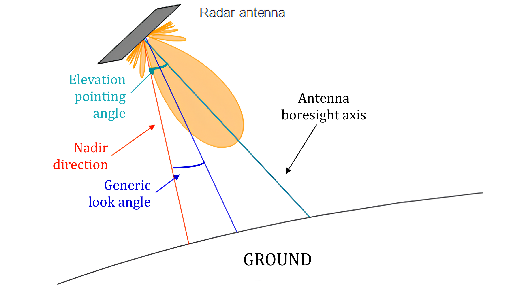
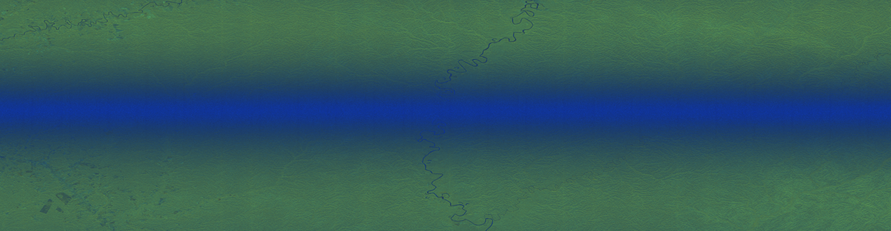

# Elevation Notch Analysis { #notch data-toc-label="Elevation Notch Analysis" }

Elevation pointing calibration estimates and corrects any bias between the nominal and actual antenna elevation pointing,
which is critical for accurate SAR data calibration. An incorrect pointing leads to improper compensation of the
**Elevation Antenna Pattern (EAP)**, causing radiometric artifacts such as gain trends in the SAR imagery.

<figure markdown="span">
    { width="900" }
    <figcaption>Satellite pointing schematics.</figcaption>
</figure>

The actual antenna pointing is estimated directly from SAR data, accounting for the fact that the beam is generally steered
toward a swath-dependent look angle rather than the antenna boresight. The calibration is performed by finding the
mis-pointing angle that best matches the measured SAR range profiles with the theoretical EAP.

To improve robustness, dedicated Elevation Notch (EN) patterns, characterized by a central low-power "hole" are used,
as shown below by an EN acquisition over rainforest areas.

<figure markdown="span">
    { width="900" }
    <figcaption>Sentinel-1 C Elevation Notch Acquisition.</figcaption>
</figure>
