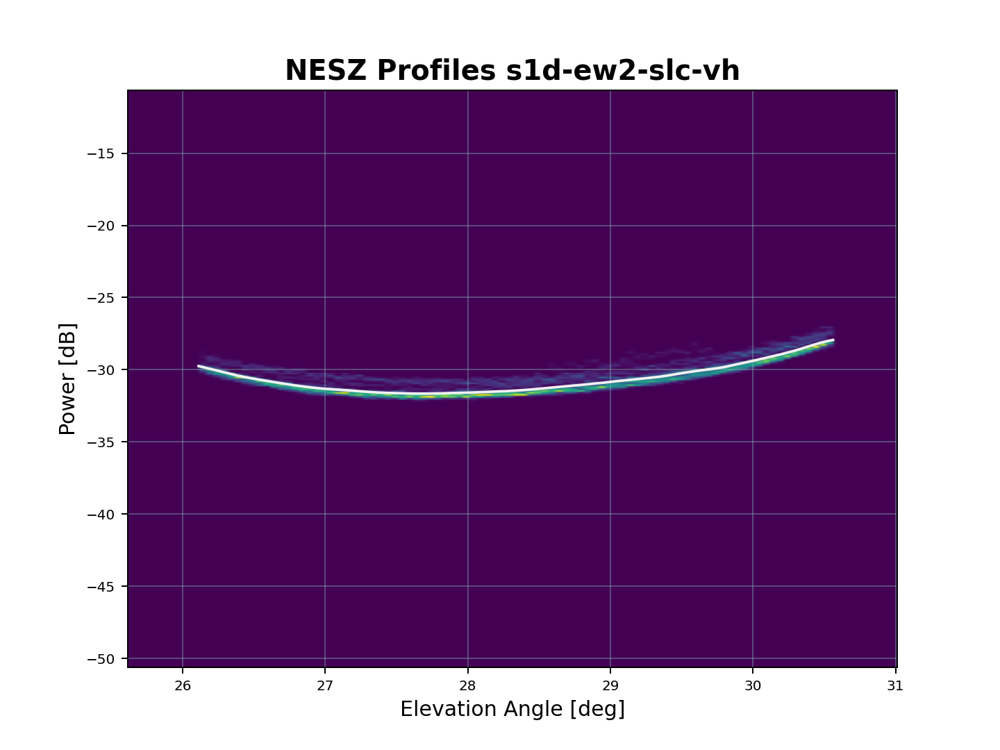
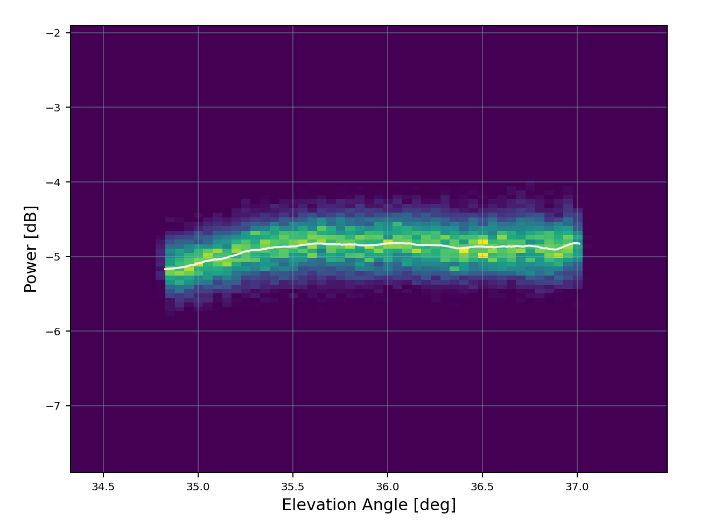
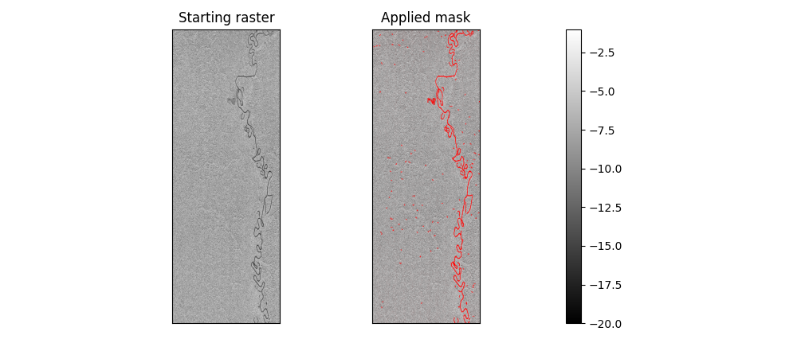
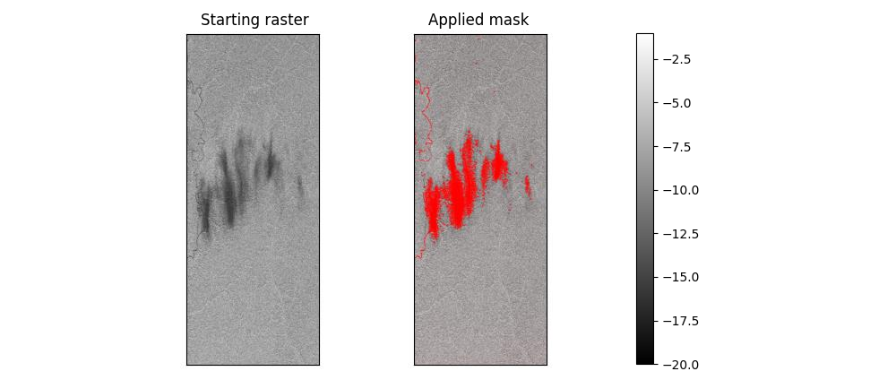

# Algorithm description (Block-Wise Radiometric Analysis)

The whole Block-Wise Radiometric Analysis algorithm is divided in several stages needed to properly assess all the desired
quantities starting from the input SAR product.

## Image Pre-Processing

The pre-processing algorithm applied when using the ``radiometric_profiles`` function or any other accessible pre-configured function
available in the ``radiometric_analysis.block_wise_analysis`` module is the same.

It consists in partitioning the whole scene in azimuth blocks using actual bursts if any, or by dividing the azimuth axis
by the provided number of lines per blocks. The representation output axis is then computed accordingly to the profile direction.

Then, for each block, data is read from the raster file, converted to intensity values (square of the absolute pixel values)
and it the radiometric quantity is converted to the selected output one, if needed.
The profile extraction algorithm can thus be applied to the data block.

This procedure is applied to each channel of the input product.

### NESZ Profiles

NESZ profiles are extracted along the **RANGE** direction, one for each azimuth partitioning block. The output radiometric
quantity is set to sigma-nought.

Low backscatter areas can be exploited for this measurement in order to assess the noise level in the image. The NESZ level
thus obtained from SLC data can then be compared with the NESZ maps if generated by the processor or, in general, with the
expected noise level.
The NESZ level estimation is typically performed for cross-pol channels only since signal level in co-pol channels is always too high.

The profile extraction algorithm for NESZ is already implemented and it consists in performing a 2D average of the valid
block data (not null values) before selecting the center of the highest-count bin of the intensity histogram performed
along azimuth direction for each range value.

<figure markdown="span">
    { width="900" }
    <figcaption>NESZ smoothed profile (the solid line) and 2D noise histogram.</figcaption>
</figure>

KPI are also estimated for each block.

### Average Elevation Profiles

Average Elevation Profiles are extracted along the **RANGE** direction, one for each azimuth partitioning block. The output radiometric
quantity can be set to any "nought" needed.

These profiles can be exploited to assess relative radiometric calibration in case of ScanSAR and TopSAR modes by comparing
the average levels from beam to beam. They can also be used in conjunction with the antenna pattern to estimate the
residual roll correction.

The profile extraction algorithm is already implemented and it consists in extracting the mean of azimuth distributed data
in the block for each range pixel after applying a median filter and performing outlier removal.
The filter and the outlier removal functionalities can be enabled/disabled and their parameters edited from the configuration
file.

<figure markdown="span">
    { width="900" }
    <figcaption>Rain Forest average profile (the solid line) and 2D histogram.</figcaption>
</figure>

KPI are also estimated for each block.

### River Masking

A **River Masking algorithm** has been developed to identify and suppress structured artifacts, such as rivers and water pools,
embedded within the almost homogeneous scattering background from the canopy. These artifacts exhibit local coherence, continuity,
and intensity correlation over extended regions. The algorithm exploits these properties by analyzing neighborhood
connectivity and directional consistency, segmenting pixels that belong to continuous, non-random structures.

These regions are then masked out, preserving only the statistically homogeneous background. By removing such correlated
contaminants prior to processing, the method prevents bias in profile estimation and avoids the introduction of
structured artifacts, leading to cleaner and more reliable downstream analysis.

<figure markdown="span">
    { width="900" }
    <figcaption>River masking on an amazonian rain forest scene, masking a river.</figcaption>
</figure>

<figure markdown="span">
    { width="900" }
    <figcaption>The masking algorithm works also on rain pools.</figcaption>
</figure>

Few parameters of this algorithm can be tweaked and tuned to optimize the masking process directly from configuration.

### Scalloping Profiles

Scalloping profiles are extracted along the **AZIMUTH** direction, one for each azimuth partitioning block. The output radiometric
quantity is set to gamma-nought.

Scalloping is a characteristic of ScanSAR and TopSAR due to the azimuth elementary pattern of each TRM introducing additional
gain factor on the squinted beams. This gain is compensated during the processing exploiting a model of the azimuth elementary
pattern. After scalloping compensation, each burst is expected to be flat in the azimuth direction.

These profiles can be used to assess the residual scalloping and thus a remarkable non-flat trend could be related to errors
in the processing compensation.

The profile extraction algorithm for scalloping is already implemented and it consists in extracting the residual profile
values along azimuth direction for each block relative to the profile mean value itself.
Outlier removal can be enabled/disabled and its parameters changed from the configuration file.

KPI are also estimated for each block.

## Custom Radiometric Profiles

Using the core ``radiometric_profiles`` function a custom radiometric profile can be configured to match the needs of the user.
Input/output radiometric quantities conversion and profile direction can be set using the configuration file or setting the
input arguments, while the profile extraction algorithm can be developed and provided as input to the main function to be
applied just after the pre-processing algorithm section.

## Analysis Output

Output data are exported in lists of custom ``RadiometricProfilesOutput`` dataclasses containing the profiles for each channel in the input product.
Each dataclass contains the profiles, the output axis and the 2D histogram of each azimuth block analyzed for that channel.

These dataclasses can then be passed as arguments to the ``support.radiometric_profiles_to_netcdf`` functionality to dump a NetCDF 4
file containing all the results and/or to the ``graphical_output.radiometric_2D_hist_plot`` to generate the 2D histogram plot.

!!! note "Graphical output"

    Graphical output functionalities are available only if the package has been installed with the ``[graphs]`` optional
    dependencies.  
    > :lucide-circle-chevron-right: Refer to the [installation documentation](../../../../install.md) for further information on how to install it.
