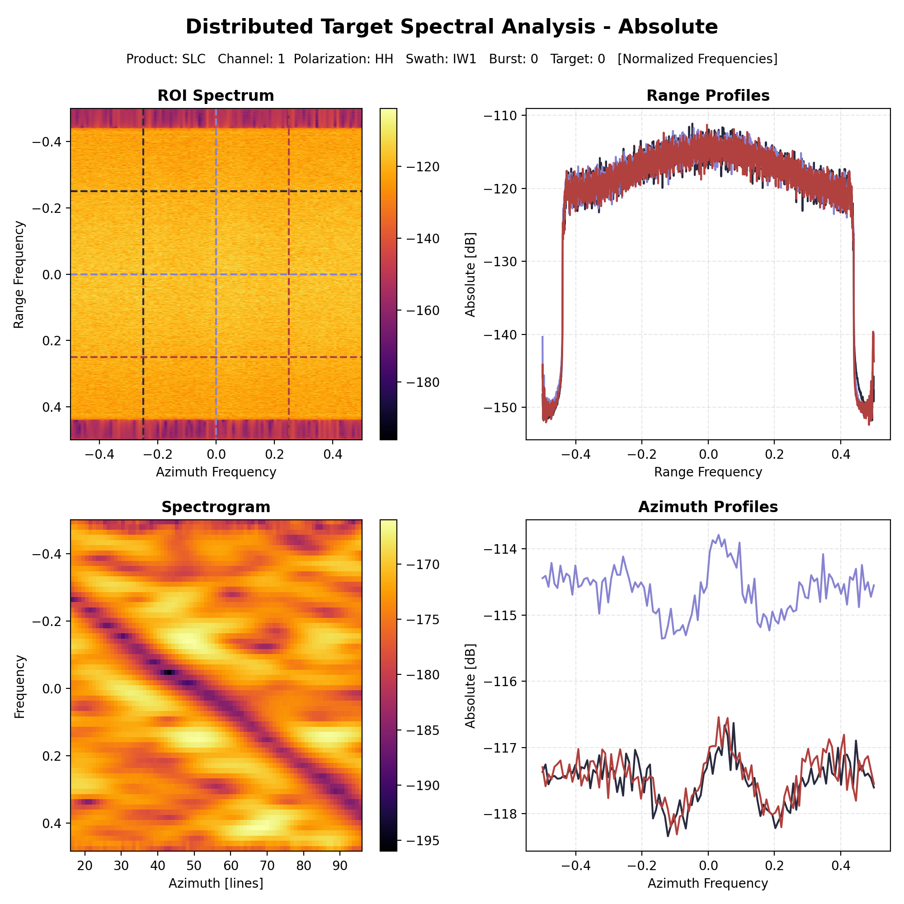
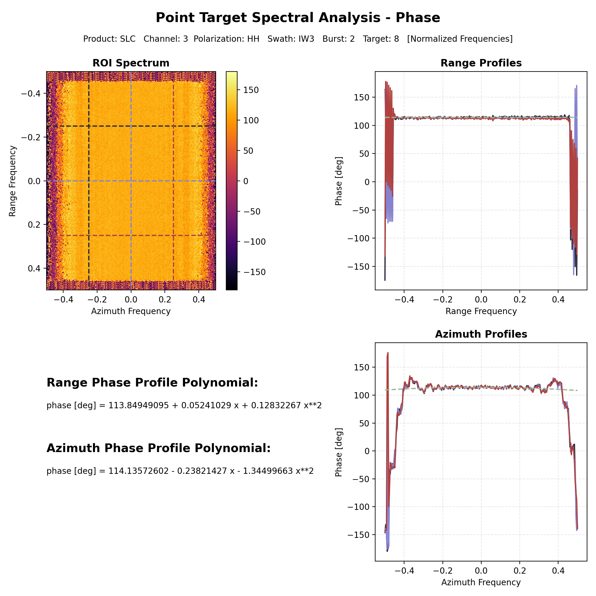

# Algorithm description

Spectral Analysis can be used to investigate the spectral content of a selected data region by extracting absolute and/or
phase profiles in the frequency domain.

## Distributed Target Spectral Analysis

Distributed targets can be investigated using this analysis by providing the pixel coordinates of one or more ROIs and
the extent of the data portion to be read. This results in **Absolute Spectral Analysis** in dB consisting in a 4-tile
chart displaying the fft of the ROI, the range and azimuth profiles and a spectrogram.

<figure markdown="span">
    { width="900" }
    <figcaption>Absolute spectral analysis profiles and frequency content.</figcaption>
</figure>

## Point Target Spectral Analysis

The same graph is generated also for the Point Target Spectral Analysis but, in addition, **Phase Spectral Analysis** is
performed to display also the phase information and profiles related to this quantity. This analysis can be performed by
providing the point target coordinates in the scene like any other analysis supporting Point Targets.

<figure markdown="span">
    { width="900" }
    <figcaption>Absolute spectral analysis profiles and frequency content.</figcaption>
</figure>

<figure markdown="span">
    { width="900" }
    <figcaption>Phase spectral analysis profiles.</figcaption>
</figure>

!!! note "Graphical output"

    Graphical output functionalities are available only if the package has been installed with the ``[graphs]`` optional
    dependencies.  
    > :lucide-circle-chevron-right: Refer to the [installation documentation](../../../../install.md) for further information on how to install it.

## Analysis Output

Spectral analysis output consists in a .nc **NetCDF4** file containing the spectral profiles computed along both
directions. Graphical output can also be generated using the ``graphical_output.spectral_graphs`` function to obtain
the plots.

!!! note "Graphical output"

    Graphical output functionalities are available only if the package has been installed with the ``[graphs]`` optional
    dependencies.  
    > :lucide-circle-chevron-right: Refer to the [installation documentation](../../../../install.md) for further information on how to install it.
