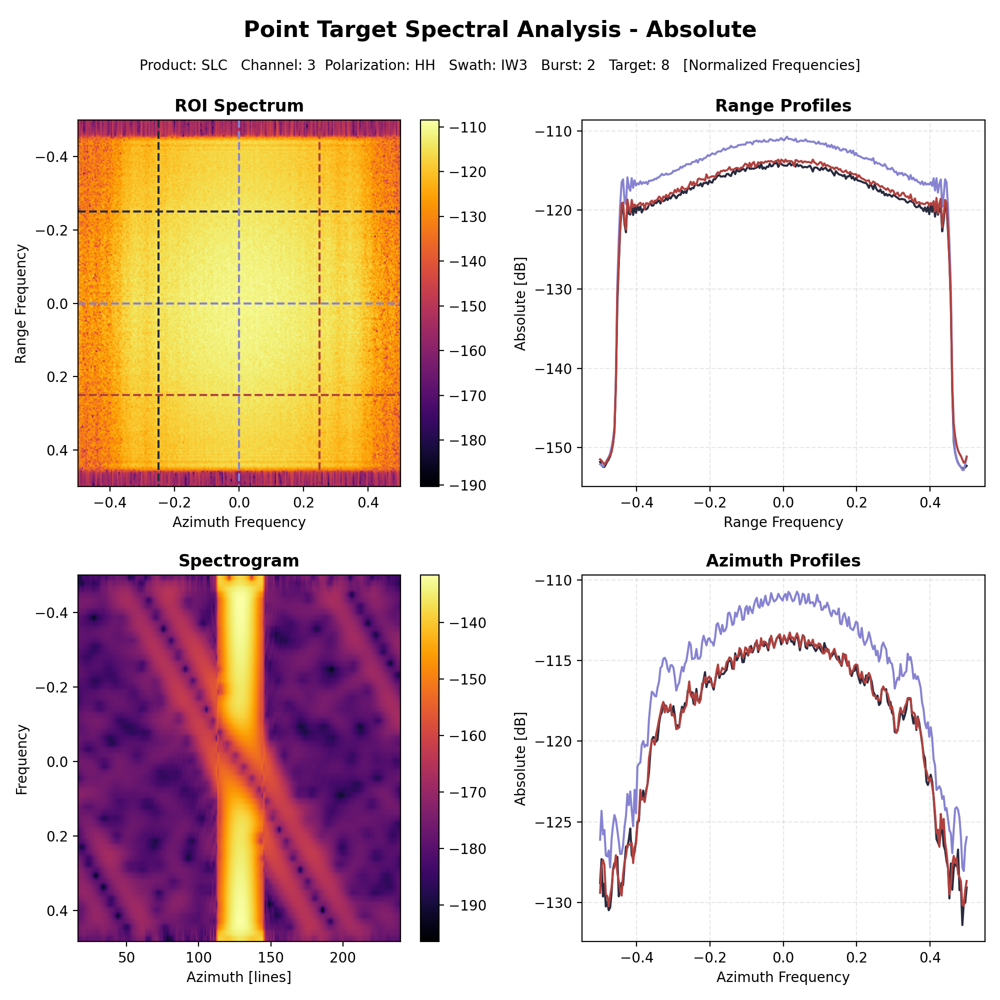

.. _quality_spect:

Spectral Analysis
=================

Spectral Analysis can be used to investigate the spectral content of a selected data region by extracting absolute and/or
phase profiles in the frequency domain. 3 profiles are extracted both along range and azimuth directions at each third
of the data portion. The results of this analysis consists in graphs only.

Distributed Target Spectral Analysis
------------------------------------

Distributed targets can be investigated using this analysis by providing the pixel coordinates of one or more ROIs and
the extent of the data portion to be read. This results in **Absolute Spectral Analysis** in dB consisting in a 4-tile
chart displaying the fft of the ROI, the range and azimuth profiles and a spectrogram.

.. figure:: ../_static/images/distributed_spectral.png
   :align: center
   :width: 1000

   Absolute Distributed Target spectral analysis profiles and frequency content

Point Target Spectral Analysis
------------------------------

The same graph is generated also for the Point Target Spectral Analysis but, in addition, **Phase Spectral Analysis** is
performed to display also the phase information and profiles related to this quantity. This analysis can be performed by
providing the point target coordinates in the scene like any other analysis supporting Point Targets.

   Absolute Point Target spectral analysis profiles and frequency content

.. figure:: ../_static/images/point_target_spectral_phase.png
   :align: center
   :width: 1000

   Phase Point Target spectral analysis profiles
