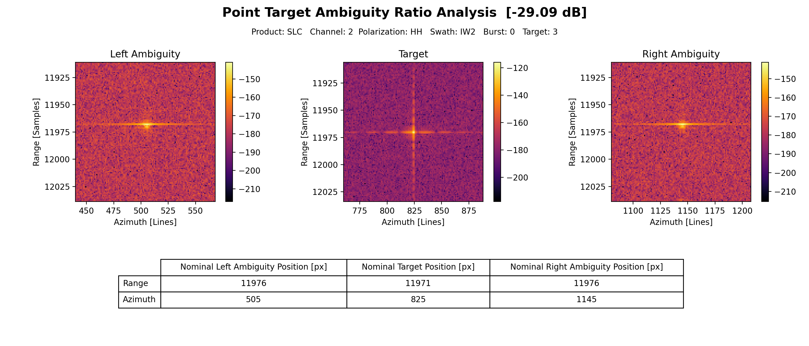

.. _quality_tar:

Target Ambiguity Ratio Analysis
===============================

Target Ambiguity Ratio (TAR) analyses can be performed on Point Targets (**PTAR**) or Distributed Targets (**DTAR**) to
compute the ratio between the signal and its ambiguities, if captured by the SAR image.

Ambiguities Location
^^^^^^^^^^^^^^^^^^^^

Left and Right ambiguities for a given target are located at well defined azimuth and range time deltas.
The azimuth distance is given by the absolute ratio between the sensor PRF and the Doppler Rate at the target location.
The range distance is instead derived from the Line of Sight variation between the target and the ambiguity location.

Point Target Ambiguity Ratio (PTAR)
^^^^^^^^^^^^^^^^^^^^^^^^^^^^^^^^^^^

This algorithms computes the ratio as:

    .. math::

        PTAR = 20\log_{10}\left(\frac{{|I_{amb_{left}}| + |I_{amb_{right}}|}}{2|I_{pt}|}\right)

Distributed Target Ambiguity Ratio (DTAR)
^^^^^^^^^^^^^^^^^^^^^^^^^^^^^^^^^^^^^^^^^

This algorithms computes the ratio as:

    .. math::

        DTAR = \frac{E(\Sigma |amb_{left}|^2) + E(\Sigma |amb_{right}|^2)}{2*E(\Sigma |target|^2)}

Graphical Output
^^^^^^^^^^^^^^^^

Graphs can be generated from the analysis output using implemented features to obtain the target and ambiguities plots
and TAR value as show in the PTAR example below.

