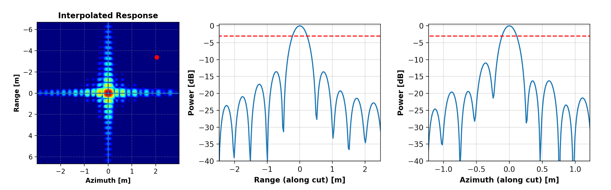

.. _quality_docs_mainpage:

################################
PERSEO Quality Documentation
################################

.. toctree::
   :maxdepth: 2
   :hidden:

   install  
   reference/api/index
   documentation/index
   changelog

``Quality`` is part of the `PERSEO` Aresys python project, and it's aimed at providing fundamental functionalities
for analyzing SAR data and quantitatively and qualitatively assess their quality and calibration features.

The following analyses have been implemented:

- **Point Target Analysis**: Impulse Response Function (IRF), Radar Cross Section (RCS) and Localization Errors
- **Block-Wise Radiometric Analysis**: Noise Equivalent Sigma-Zero (NESZ), Average Elevation Profiles, Scalloping Profiles and custom radiometric profiles
- **Point-Wise Radiometric Analysis**: point wise radiometric profiles along azimuth and/or range directions
- **Interferometric Analysis**: interferometric coherence analysis and graphical representation
- **Point & Distributed Target Ambiguity Ratio (PTAR/DTAR) Analysis**: ambiguity ratio analysis both for Point Targets and Distributed Targets
- **Point & Distributed Target Spectral Analysis**: absolute and phase spectral analysis for Point Targets and Distributed Targets
- **Equivalent Number of Looks (ENL) Analysis**: equivalent number of looks analysis
